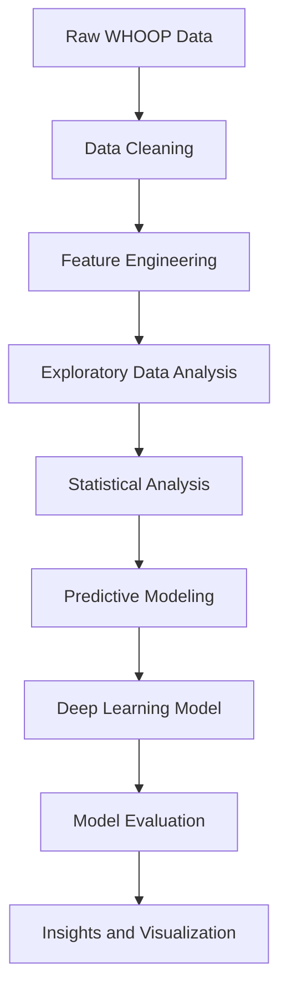
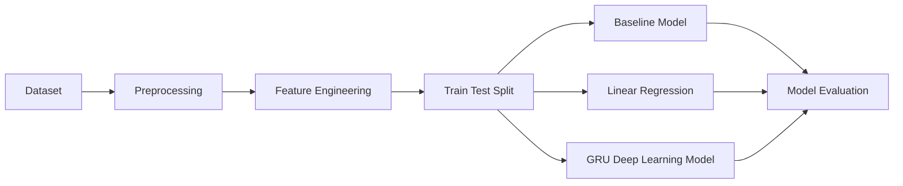
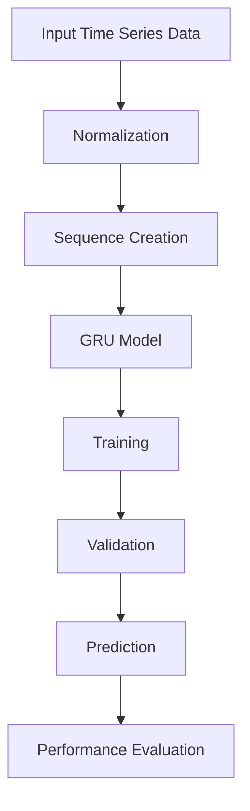

# 🧠 Sleep Architecture & Recovery Prediction Using WHOOP Data
### 📘 DAMO-699 Capstone Project – Wearable Health Analytics


---

## 🌟 Project Highlights

- 📊 End-to-end wearable health analytics project using WHOOP data
- 🛌 Analysis of sleep architecture and physiological recovery
- 🤖 Machine learning and GRU-based deep learning modeling
- 📈 Time-series prediction of next-day HRV
- 🧪 Statistical testing of sleep and activity relationships
- 📉 Visual insights into metabolic intensity and recovery trends

---

## 📚 Table of Contents

- [📌 Project Overview](#-project-overview)
- [🎯 Research Questions](#-research-questions)
- [🗂️ Dataset](#️-dataset)
- [🔄 Project Pipeline](#-project-pipeline)
- [🧪 Analytical Methods Used](#-analytical-methods-used)
- [📁 Project Structure](#-project-structure)
- [🛠️ Technologies Used](#️-technologies-used)
- [💡 Key Insights](#-key-insights)
- [🚀 Future Work](#-future-work)

---

## 📌 Project Overview

Wearable health devices generate continuous physiological data such as sleep stages, recovery metrics, and activity intensity. Understanding the relationship between these variables is essential for improving health monitoring and recovery optimization.

This capstone project analyzes wearable fitness data collected from **WHOOP devices** to explore how **sleep architecture** and **activity intensity** influence physiological recovery.

The project combines **statistical analysis, predictive modeling, and deep learning techniques** to uncover patterns in physiological signals and predict next-day recovery indicators such as **Heart Rate Variability (HRV)**.

---

## 🎯 Research Questions

**RQ1**  
How do Deep Sleep and REM Sleep durations correlate with next-day Heart Rate Variability (HRV)?

**RQ2**  
Can deep learning models predict next-day HRV using historical physiological signals?

**RQ3**  
Do different activity types exhibit significantly different metabolic intensities?

**RQ4**  
Which predictive modeling approach provides the most accurate recovery predictions?

---

## 🗂️ Dataset

The dataset used in this project originates from **WHOOP wearable fitness trackers**.

It contains daily physiological and activity measurements including:

- user_id
- date
- heart rate variability (HRV)
- recovery score
- deep sleep duration
- REM sleep duration
- activity duration
- calories burned
- activity type

This dataset enables analysis of relationships between **sleep architecture, activity intensity, and recovery performance**.

---

## 🔄 Project Pipeline



---

## 🤖 Machine Learning Pipeline



---

## 🧠 Deep Learning Model Workflow



---

## 🧪 Analytical Methods Used

<details>
<summary><strong>📊 Statistical Analysis</strong></summary>

- Pearson Correlation Analysis
- One-Way ANOVA
- Descriptive Statistics

These methods help determine whether meaningful relationships exist between sleep stages and physiological recovery metrics.

</details>

<details>
<summary><strong>🤖 Predictive Modeling</strong></summary>

- Baseline Mean Model
- Linear Regression Model

Baseline models provide a reference point for evaluating predictive performance.

</details>

<details>
<summary><strong>🧠 Deep Learning</strong></summary>

A **GRU neural network** is used to capture temporal patterns within physiological time-series data.

The model predicts next-day HRV based on previous physiological signals and sleep metrics.

</details>

<details>
<summary><strong>📈 Visualization</strong></summary>

The project generates multiple visual outputs including:

- Deep Sleep vs HRV scatter plots
- REM Sleep vs HRV scatter plots
- Activity metabolic intensity comparisons
- Model performance comparison charts

These visualizations help interpret statistical results and identify physiological patterns.

</details>

---

## 📁 Project Structure

```bash
DAMO-699-Capstone-project-Whoop/
│
├── notebooks/
│   └── whoop_analysis.ipynb
│
├── src/
│   ├── data_prep.py
│   ├── rq1_sleep_vs_hrv.py
│   ├── rq2_recovery_prediction.py
│   └── rq3_metabolic_intensity.py
│
├── outputs/
│   ├── cleaned_whoop.csv
│   ├── analysis_results.csv
│   └── figures/
│
├── README.md
├── requirements.txt
└── .gitignore
```

---

## 🛠️ Technologies Used

- Python
- Pandas
- NumPy
- Matplotlib
- SciPy
- Scikit-Learn
- TensorFlow / Keras

These technologies support efficient data cleaning, statistical analysis, predictive modeling, deep learning, and visualization.

---

## 💡 Key Insights

- Initial analysis indicates that individual sleep stages show weak direct correlations with next-day HRV.
- Activity intensity shows statistically significant differences across activity types.
- Deep learning models capture temporal physiological patterns and demonstrate improved prediction capability compared to baseline models.
- These findings highlight the complexity of physiological recovery processes and the importance of analyzing multiple interacting factors.

---

## 🚀 Future Work

- Expand the dataset to include more users and longer time periods
- Implement advanced time-series models such as LSTM or Transformers
- Build interactive dashboards using Power BI or Streamlit
- Incorporate additional physiological metrics such as resting heart rate and strain score

---

## 🙌 Conclusion

This project demonstrates how wearable physiological data can be transformed into meaningful health insights using a combination of **statistics**, **machine learning**, and **deep learning**. It provides a strong foundation for future work in **wearable analytics**, **recovery prediction**, and **personalized health monitoring**.
